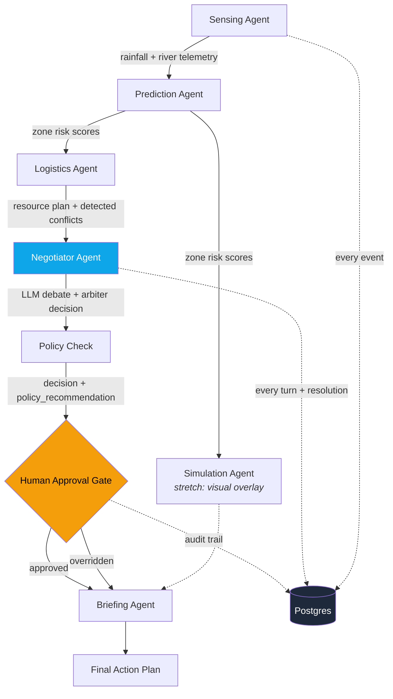

<div align="center">


<a href="#">
  
</a>

<br/>

[]()
[](#license)
[](https://www.python.org/)
[](https://nodejs.org/)
[](#design-principles)


</div>

<br/>

<div align="center">

</div>

<br/>

> **AEGIS** is a multi-agent decision-support system for disaster response. It predicts hazard spread, proposes resource allocations, surfaces conflicts through transparent AI-to-AI negotiation, and routes every decision through a documented policy check and a **mandatory human approval gate** before it becomes final. Nothing in AEGIS acts on the world — it proposes, explains its reasoning, and waits.

<br/>

## 📖 Table of Contents

<table>
<tr>
<td width="50%" valign="top">

- [🎯 Why AEGIS Exists](#-why-aegis-exists)
- [🧠 What It Actually Does](#-what-it-actually-does)
- [🏗️ Architecture](#️-architecture)
- [🛡️ Design Principles](#️-design-principles)
- [🛠️ Tech Stack](#️-tech-stack)

</td>
<td width="50%" valign="top">

- [🚀 Getting Started](#-getting-started)
- [📡 API Surface](#-api-surface)
- [🧪 Testing](#-testing)
- [🌐 Data Sources](#-data-sources)
- [🗺️ Roadmap & Limitations](#️-roadmap--limitations)

</td>
</tr>
</table>

<br/>

## 🎯 Why AEGIS Exists

Disaster response today is siloed. Flood and cyclone forecasts, resource inventories, and evacuation planning are typically handled by separate tools, forcing human coordinators to manually reconcile conflicting priorities under extreme time pressure — usually with incomplete information and no record of why a given tradeoff was made.

AEGIS doesn't try to remove the human from that decision. It tries to make the decision **faster to reach**, the tradeoffs **easier to see**, and the outcome **auditable after the fact** — three things manual coordination structurally struggles to do under pressure.

> **What AEGIS is not:** a certified emergency-management system, a replacement for official meteorological or disaster-authority alerts, or a system designed to make unilateral decisions in a live emergency. See [Roadmap & Limitations](#️-roadmap--limitations).

<br/>

## 🧠 What It Actually Does

Given live or historical hazard data for a location, AEGIS runs a five-stage pipeline:

<table>
<tr>
<td width="20%" align="center" valign="top">

### 01 — Sense
Current rainfall and river-discharge conditions for a real location, or a replayed historical scenario.

</td>
<td width="20%" align="center" valign="top">

### 02 — Predict
Relative flood risk across modeled zones via an explainable, weighted scoring function — no black box.

</td>
<td width="20%" align="center" valign="top">

### 03 — Allocate
Shelters, ambulances, tankers, and routes are matched to risk; conflicts are detected deterministically.

</td>
<td width="20%" align="center" valign="top">

### 04 — Negotiate
A structured LLM debate (evacuation vs. logistics) proposes a resolution, checked against an independent policy.

</td>
<td width="20%" align="center" valign="top">

### 05 — Wait
A human operator approves or overrides every conflict before a final briefing is ever produced.

</td>
</tr>
</table>

Every step streams live to a command-center interface and is permanently recorded — any scenario can be replayed exactly as it happened, including who approved or overrode what, and when.

<br/>

## 🏗️ Architecture



<div align="center">

| Stage | Agent | Type | Notes |
|:---:|:---:|:---:|---|
| Sense | `sensing_node` | Live API (keyless) | Open-Meteo + GloFAS; soft-fails to demo data on any error |
| Predict | `prediction_node` | Deterministic scoring | Backtested against real historical flood outcomes |
| Allocate | `logistics_node` | Deterministic allocation | Detects conflicts by construction, not LLM judgment |
| Negotiate | `negotiator_node` | LLM (Groq / Ollama) | Structured 4-turn debate → arbiter decision |
| Check | `policy_node` | Deterministic rules | Independent priority formula; flags disagreement |
| Approve | Human, via API/UI | — | Mandatory gate; pipeline pauses until resolved |
| Brief | `briefing_node` | LLM (Groq / Ollama) | Plain-language summary for a first responder |

</div>

State moves through the pipeline as a typed `ScenarioState` object (LangGraph), and every meaningful transition — results, conflicts, negotiation turns, resolutions, approvals, overrides — is written to Postgres as it happens, not batched after the fact.

<br/>

## 🛡️ Design Principles

<table>
<tr>
<td width="50%" valign="top">

### 🚦 Proposal, Not Autonomy
The Negotiator's arbiter produces a *proposed* resolution, never a final one. `conflicts.status` only reaches `approved` or `overridden` through an explicit human action, recorded with who acted and when.

</td>
<td width="50%" valign="top">

### ⚖️ Debate ≠ Decision Authority
Every arbiter decision is checked against an independent, hand-written priority policy (`policy.py`) computed without any LLM call. Disagreement is surfaced to the approver, never silently resolved.

</td>
</tr>
<tr>
<td width="50%" valign="top">

### 🎯 Honesty Over Confidence
Where hydrology data is thin, AEGIS reports `not_applicable` / `insufficient_hydrology_data` rather than fabricating a plausible-looking number. A wrong-but-confident answer is worse than a labeled gap.

</td>
<td width="50%" valign="top">

### 🗄️ An Audit Trail That Survives a Restart
Every agent result, negotiation turn, and human decision is persisted to Postgres as it occurs, so any scenario can be replayed in full after a process restart.

</td>
</tr>
</table>

<br/>

## 🛠️ Tech Stack

<div align="center">


</div>

<br/>

<div align="center">

| Orchestration & Backend | AI / LLM Layer | Prediction & Policy | Frontend |
|:---:|:---:|:---:|:---:|
| LangGraph | Groq API — Llama 3.3 70B | Rule-based weighted scoring | Next.js (App Router, TS) |
| FastAPI (async) | Ollama (local, offline fallback) | Backtested against real flood data | Tailwind CSS |
| Native WebSockets | Swappable client — one-file provider switch | Independent, auditable policy | Framer Motion |
| SQLAlchemy 2.0 + asyncpg + Alembic | — | Runs without any LLM call | — |

</div>

<div align="center">

**💰 Cost to run end to end: $0.** No paid APIs required at any point in the pipeline.

</div>

<br/>

## 🚀 Getting Started

<details>
<summary><b>Click to expand — Prerequisites</b></summary>

- Python 3.11+
- Node.js 18+
- Docker (for local Postgres)
- A [Groq API key](https://console.groq.com/) (free tier) — or [Ollama](https://ollama.com/) running locally for a zero-key setup

</details>

```bash
# Backend
cd backend
python -m venv venv && source venv/bin/activate
pip install -r requirements.txt

cp .env.example .env
# Fill in DATABASE_URL, LLM_PROVIDER, and either GROQ_API_KEY or OLLAMA_BASE_URL

docker compose up -d db
alembic upgrade head
uvicorn main:app --reload
```

```bash
# Verify the LLM client independently before running the full pipeline
python test_llm.py
```

```bash
# Frontend
cd frontend
npm install
npm run dev
```

Visit `http://localhost:3000`.

<br/>

## 📡 API Surface

<div align="center">

| Method | Endpoint | Purpose |
|:---:|---|---|
| `GET` | `/health` | Liveness check |
| `POST` | `/run-scenario` | Start a new scenario (demo or live data mode) |
| `WS` | `/ws/feed/{scenario_id}` | Live event stream; falls back to stored-event replay |
| `GET` | `/scenarios` | List past scenarios |
| `GET` | `/scenarios/{id}` | Full replay: events, conflicts, negotiation turns, resolutions |
| `POST` | `/scenarios/{id}/conflicts/{conflict_id}/approve` | Approve a proposed resolution — requires approver identity |
| `POST` | `/scenarios/{id}/conflicts/{conflict_id}/override` | Override with a human decision + reason — requires approver identity |

</div>

<br/>

## 🧪 Testing

```bash
cd backend
pytest
```

The suite spins up an isolated test database and a dedicated backend process per run — safe to run repeatedly, including in CI.

<details>
<summary><b>Click to expand — Coverage</b></summary>

- Deterministic agent logic (prediction, logistics, policy) — token-free, no LLM calls
- Negotiator debate structure and failure handling, with the LLM stubbed
- Full pipeline persistence, including a process-restart replay test
- Concurrency (simultaneous scenarios, simultaneous conflicts)
- Edge and malformed input (boundary risk values, zero-capacity resources, self-referential conflicts)
- Failure injection (unreachable LLM provider, dropped database connection, invalid approval requests)

See [`backend/validation/RESULTS.md`](./backend/validation/RESULTS.md) for the prediction model's backtest against real historical flood data.

</details>

<br/>

## 🌐 Data Sources

<div align="center">

| Source | Used For | Key Required |
|:---:|:---:|:---:|
| Open-Meteo Weather API | Live rainfall | ❌ No |
| Open-Meteo Geocoding API | Free-text location search | ❌ No |
| GloFAS | River discharge / level | ❌ No |

</div>

All live data calls soft-fail to a static demo scenario on any network or API error — the pipeline never hard-fails due to an external outage.

<br/>

## 🗺️ Roadmap & Limitations

AEGIS is a decision-**support** tool, not a decision-making authority, and it has real, specific limitations. The full statement — including what the prediction model has and hasn't been validated against, known gaps in hydrology data coverage, and explicit non-goals — lives in [`LIMITATIONS.md`](./LIMITATIONS.md). Please read it before evaluating or deploying AEGIS for any real use.

**Not yet implemented — listed here rather than claimed as done:**

- [ ] Replace the synthetic 18-zone model with real sub-district-level geography (see `LIMITATIONS.md` for scope notes)
- [ ] Persist and query the Simulation Agent's visual output as first-class data, not only event payload
- [ ] Configurable alerting on unanswered approval timeouts (currently emits an event only)
- [ ] Expand hazard coverage beyond riverine flooding (wildfire, heatwave) on the same agent architecture

<br/>

## 🤝 Contributing

Issues and pull requests are welcome. Before submitting a change that affects the prediction model or the policy layer, please include the reasoning behind it — these components are deliberately explainable, and undocumented changes undermine that.

<br/>

## 📄 License

MIT

<br/>

<div align="center">

### 🛡️ A proposal-and-approval system — not an autonomous actor.

*Predict. Allocate. Negotiate. Brief. A human decides.*


</div>